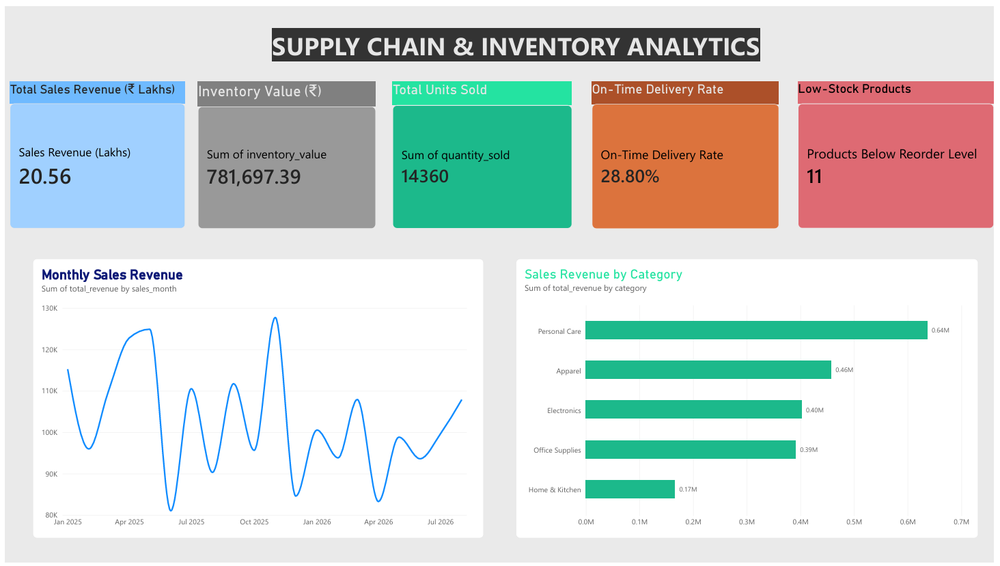
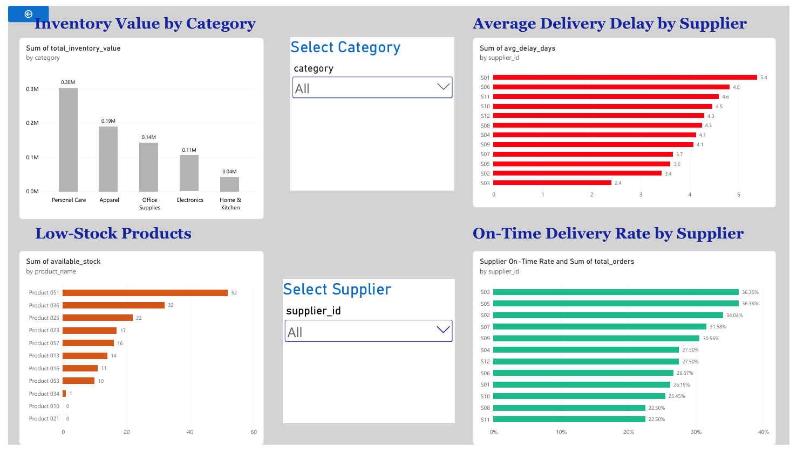

# Supply Chain & Inventory Analytics

## Project Overview

An end-to-end data analytics project focused on analyzing sales performance, inventory levels, stock shortages, and supplier delivery performance using Python, SQL, and Power BI.

The project uses synthetic practice data to demonstrate data cleaning, analysis, KPI development, and interactive dashboard creation.

## Tools & Technologies

* Python (Pandas, NumPy)
* SQL (SQLite)
* Power BI (DAX, interactive dashboards)
* Excel / CSV

## Key Features

* Sales revenue and units sold analysis
* Inventory valuation and stock availability analysis
* Low-stock product identification using reorder levels
* Supplier delivery delay and on-time delivery analysis
* Category-wise sales and inventory insights
* Interactive Power BI dashboards

## Key Business Insights

* Total sales revenue: ₹20.56 lakh
* Total units sold: 14,360
* Total inventory value: ₹7.82 lakh
* Products below reorder level: 11
* Overall on-time delivery rate: 28.80%

## Dashboard Pages

### 1. Sales Overview

* KPI cards
* Monthly Sales Revenue
* Sales Revenue by Category

### 2. Inventory & Supplier Analysis

* Inventory Value by Category
* Low-Stock Products
* Average Delivery Delay by Supplier
* On-Time Delivery Rate by Supplier

## Project Structure

* `products.csv`
* `suppliers.csv`
* `inventory_snapshot.csv`
* `sales_orders.csv`
* `purchase_orders.csv`
* `powerbi_data/`
* `Supply_Chain_Inventory_Analytics.pbix`
* `Supply_Chain_Inventory_Analytics.pdf`

## Objective

To transform raw supply chain data into meaningful business insights that support inventory planning, sales monitoring, and supplier performance evaluation.

To transform raw supply chain data into meaningful business insights that support inventory planning, sales monitoring, and supplier performance evaluation.

## Dashboard Screenshots

### Page 1: Sales Overview

### Page 2: Inventory & Supplier Analysis

